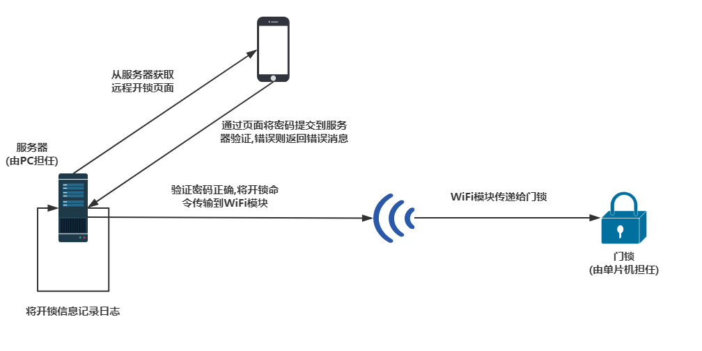
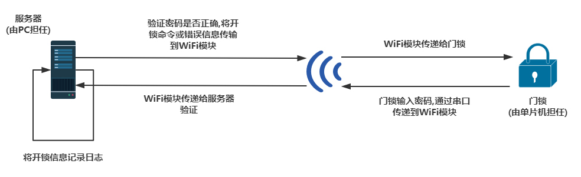
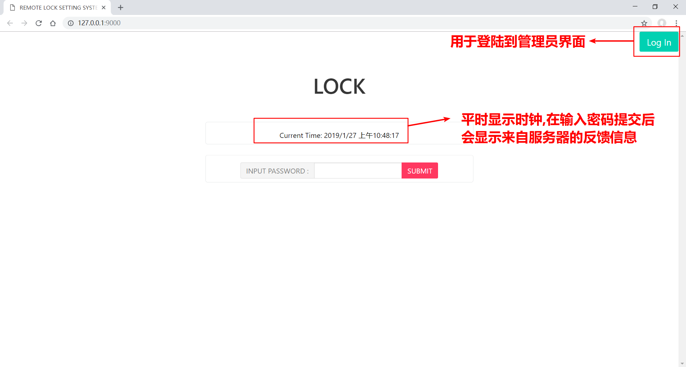
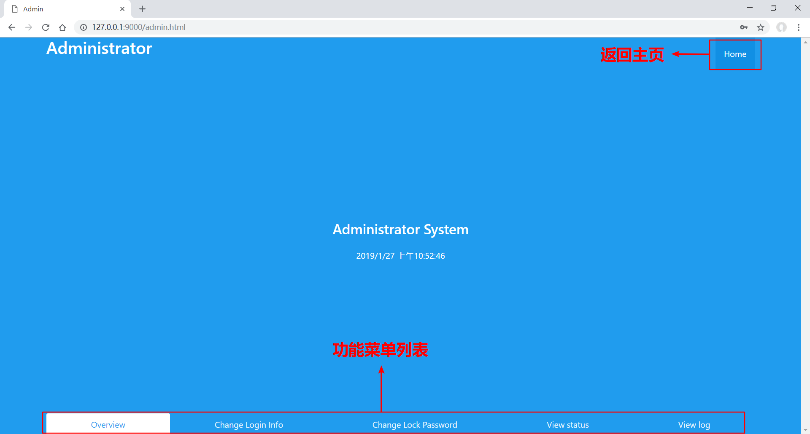
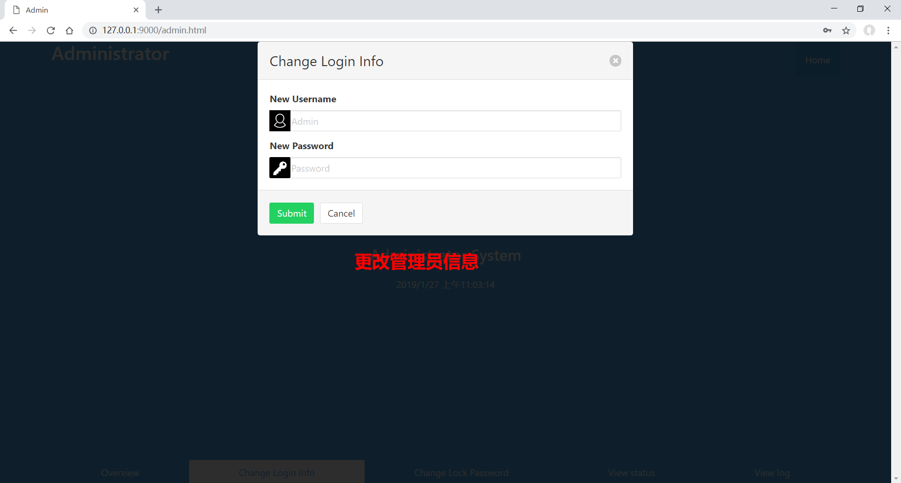
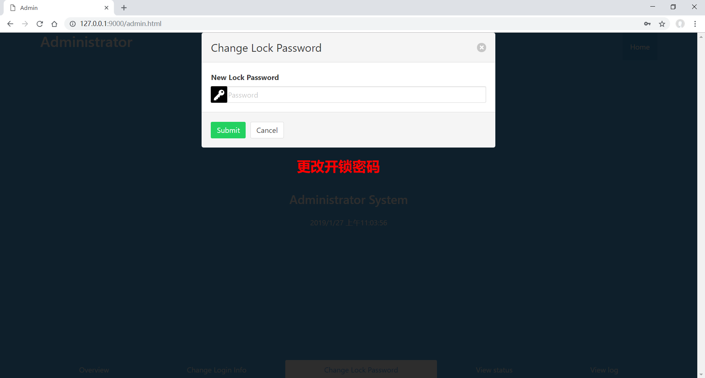
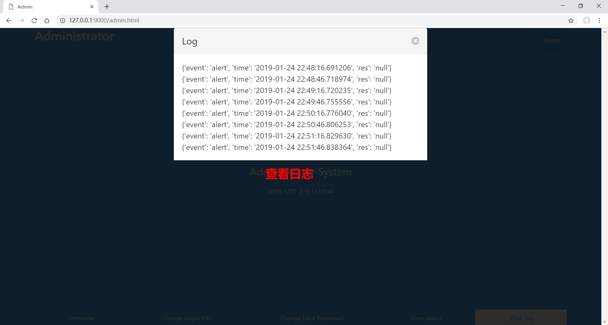

# 嵌入式期末项目实验报告

[TOC]

| 姓名         | 学号     |
| ------------ | -------- |
| 吴梓溢       | 16340243 |
| 王迎旭(组长) | 16340226 |
| 王显淼       | 16340224 |

---------------


[**项目 `github` 仓库地址**](https://github.com/Z1Wu/embedded_system_design_course_final_proj)

## 1. 项目概述

### (1) 项目背景


### (2) 项目功能

具有日志功能的可远程开锁的门锁


-----------------

## 2. 相关技术

### (1) 硬件电路

* 继续采用期中项目使用的STC51的单片机, 外加具备node-mcu平台的WiFi模块（esp8266)

### (2) 后端设计

* Windows10 + python3.5
* 工作分为一下两个部分
  * 一部分是作为静态服务器，提供与浏览器端的交互。
  * 另一部分是作为一个与单片机交互【通过wifi模块】的后台，提供密码验证和存储操作记录的功能。

### (3) 前端设计

* Windows10 + chrome + VS code + (HTML+CSS+Javascript)
* 主要工作: 完成远程开锁的UI和管理员系统的UI

---------------

## 3. 系统设计

### (1). 总体设计

#### I. 手机端开锁



#### II. 门锁端开锁



### (2) 硬件电路设计

#### I. 实现细节

门锁实现沿用期中项目外部门锁设计,可以通过键盘输入密码,改变的方面是在单片机上进行**串口通信**的有另一个单片机变成了WiFi模块。单片机通过WiFi模块将输入的密码传输给PC端,PC端也通过WiFi模块给单片机发送消息。

#### II. 实际连接图(TODO)

  

**注意:** WiFi模块与单片机的串口连接必须共地,否则无法正常工作

#### III. 单片机设计

* 在不工作时,显示时钟。

* 通过按键进入输入密码的阶段,输入密码后通过按键确认密码输入

* 代码细节(由于大部分代码和之前的实验差不多，这里只贴出部分代码，详细代码点击[这里]())

  * **定时向 esp8266 模块发送状态，当前门的状态**

  * ```c
    if(state == STATE_DOOR_OPEN && msecond % ALERT_INTERVAL == 0) {
                    if(door_open_time > 5) {
                        door_open_time = 0;
                        alert();
                    }
                    door_open_time ++;
                }
    ```

  * 抽象出单片机内部的状态转移流程

  * ```c
    if(state == STATE_INPUTTING && KeyCode >= 17 &&  KeyCode <= 26)              
                    {
                        password[curPos++] = KeyCode % 17;
                    } else if(KeyCode == INPUT_CONFIRM_KEY_CODE) {
                        if(curPos == 8) {
    						u8 i;
    						u8 tmp[8];
    						for(i = 0; i < 8; i++) {
    							tmp[i] = password[i] + 48;							
    						}
                           	PrintString1(tmp);
                        }
                    } else if(state == STATE_INVALIAD && KeyCode == REINPUT_KEY_CODE) {
                        state = STATE_INPUTTING;
                        initPassword();
                    } else if(state == STATE_DOOR_OPEN && KeyCode == CLOSE_DOOR_KEY_CODE) {
                        // 如果有报警则取消报警
                        cloesDoor();
                    } else if(state == STATE_VALIAD && KeyCode == OPEN_DOOR_KEY_CODE) {
                        // 直接开门
                        openDoorWithoutAlert();
                    }
    ```

#### IV. WiFi模块功能设计

首先明确WiFi模块在整个系统中担任的角色-----**中间传输**

所以我们通过node-mcu提供的接口,按照以下方式设计WiFi模块的功能:

* 作为一个客户端(类比):  将单片机通过串口传输过来的数据发送到服务器
* 作为一个服务器(类比):  此时,WiFi模块与服务器的角色互换, WiFi模块接收来自服务器的反馈

代码细节：（wifi 模块的代码都是基于 esp8266 模块内置的sdk (`node mcu`), 进行开发，这个套件使用 `lua` 脚本语言作为开发语言，抽象了很多细节，而且是基于回调的"编程范式"，开发起来较为方便）

- 监听来自单片机通过 `uart` 传输过来的数据，同时把接收的数据发送到服务器。

- ```lua
  
  -- uart 
  -- 增加鲁棒性, 最后一个参数应该设置成0, 避免从 uart 的输入进入到 esp8266 中的interpreter 中
  -- 由于执行的顺序问题，这个函数应该放在最后面，不然串口写入的脚本无法进入到控制台被执行
  
  uart.on("data", '*',
    function(data)
      if(string.len(data) ~= 9 ) then
          -- do nothing, 
          return
      end
      print("receive from uart:", data)
      data = string.sub(data, 0, 8)
      print(data)
      if data == "quitquit" then
          ledLight()
          print("cancel listener")
          uart.on("data")
      else
          -- receive input password from the door, send data to server and wait for response 
          sendData(remote_server_ip, remote_server_port, data)
      end
  end, 0)
  ```

- 监听来自远程(云)服务器的输入，并把结果通过`uart`传输到单片机。

- ```lua
  -- create server
  function startServer()
      sv = net.createServer(net.TCP, 30)
      function receiver(sck, data)
          print(data)
          sck:close()
          if(data == "test") then
              sendData(remote_server_ip, remote_server_port, "hello from the other side")
          end
          -- send data to remote door
          changeDoorState(data)
      end
      if sv then
          sv:listen(8080, function(conn)
              conn:on("receive", receiver)
              conn:send("hello world")
          end)
      end
  end
  ```

### (3) 后端设计

处于实验报告的篇幅，这里只贴出部分代码。

#### 和前端的交互

1. 首先需要先和约定相关的 api, 详情见[这里](https://github.com/Z1Wu/embedded_system_design_course_final_proj)

2. 按照 api 建立 http 服务器，监听对应的端口（在本次项目中是 `9000`端口）

3. 提供的功能大概包括：

   - 存储开门信息
   - 验证输入的密码
   - 存储门的状态信息。

4. 由于本次项目规模比较小，没有使用现成的后端框架，而是根据需求写了一个简单的服务器（功能有限，只是能跑而已。）

   ```python
   class MyHandler(BaseHTTPRequestHandler):
       # static member
       STATIC_FILE_PATTERN = r'.*(/|\.html|\.js|\.css|\.png)$'
       
       suffix2MIME = {
           "png" : "image/png",
           "jpeg" : "image/jpeg",
           "html": "text/html",
           "js":"text/javascript",
           "css":"text/css"
       }
   
       def handle_static_file(self, rel_path, is_binary = False):
           prefix = "../front_end"
           content = None
           try:
               path = prefix + rel_path
               print("static => read file in " + path)
               mode = "r"
               if is_binary :
                   mode = "rb"
               content = open(path, mode).read()    
           except FileNotFoundError:
               content = "File not found"
           return content
   
       def do_GET(self):
           path = self.path
           static_file_match = re.match(MyHandler.STATIC_FILE_PATTERN, path)
           
           if static_file_match != None:
               suffix = static_file_match.group(1)
               is_binary = False
               print("suffix: " + suffix)
               if suffix == '/':
                   suffix = '.html'
                   path += 'index.html'
               mime_type = MyHandler.suffix2MIME[suffix[1:]] 
               if not mime_type.startswith('text'):
                   is_binary = True
               content = self.handle_static_file(path, is_binary)
               response = self.handle_http(200, content, mime_type)
               self.wfile.write(response)
           elif path == '/get_lock_status':
               self.wfile.write(self.handle_http(200, state, "text/plain"))
           elif path == '/get_log':
               log_list = db.table("_default").all()
               logs=""
               for log in log_list:
                   logs = logs+str(log)+"\n"
               self.wfile.write(self.handle_http(200, logs, "text/plain"))
   
       def do_POST(self):
           content_len = int(self.headers.get('content-length', 0))
           content = self.rfile.read(content_len)
           if(self.path == "/open-door"):
               # 输入密码，打开门
               pw = content.decode()
               print("post data : ", pw)
               # 把远程开锁的结果发送给wifi模块，wifi模块控制单片机开门, 同时把结果放回给浏览器显示密码的正确情况 
               if pw == PASSWORD: 
                   # 如果输入结果正确，打开门
                   self.wfile.write(self.handle_http(200, "true", "text/plain"))
                   SendDataToWifiModule(REMOTE_HOST, REMOTE_HOST_PORT, b'o').start()
               elif pw != PASSWORD:
                   self.wfile.write(self.handle_http(200, "false", "text/plain"))
               else:
                   pass
               
               # 把结果返回给浏览器
               #self.wfile.write(self.handle_http(200, str(data), "text/html"))
           elif self.path == "/login":
               print(content)
               # get the target
               post_body = str(content)
               try:
                   user, password = self.extractInfoFromPB(post_body)
                   print(user, password)
               except:
                   print("invalid post-body", post_body)
   
               data = None
               if user != ADMIN_USER or password != ADMIN_PASSWORD:
                   data = 2
               else:
                   data = 0
               self.wfile.write(self.handle_http(200, str(data), "text/plain"))
           elif self.path == "/change_info":
               print(content)
               new_user, new_password = self.extractInfoFromPB(str(content))
               changeAdminInfo(new_user, new_password)
               self.wfile.write(self.handle_http(200, "true", "text/plain"))
           elif self.path == "/change_lock_password":
               print(content)
               changeLockPassword(str(content.decode()))
               self.wfile.write(self.handle_http(200, "true", "text/plain"))
   
       def extractInfoFromPB(self, raw):
           user, password = raw.split("&")
           user = user[user.index('=') + 1 : ]
           password = password[password.index('=') + 1: -1]
           return user, password
   
       def handle_http(self, status_code, content, type = 'text/html'):
           self.send_response(status_code)
           self.send_header('Content-type', type)
           self.end_headers()
           if not type.startswith("text"):
               return content
           return bytes(content, 'UTF-8')
   ```

#### 和wifi模块的交互

1. 一方面需要监听来自wifi 模块传输的数据---用于更新门的状态等。

   ```python
   ## 运行在新线程中，监听来自 wifi 模块的信息
   def receiver():
       global connection, state
       sock = socket.socket(socket.AF_INET, socket.SOCK_STREAM)
       sock.bind(('0.0.0.0',9090))
       sock.listen(5)
       while True:
           connection = None
           print("wating connection from wifi module ... ")
           connection, address = sock.accept()
           print("connect to wifi module with address: ", address)
           buf = connection.recv(1024)            
           input = buf.decode()
           print("from wifi module:", input)
           
           # the check order matters
           if input == 'oooooooo':
               state = STATE_DOOR_OPEN
           elif input == 'cccccccc':
               state = STATE_DOOR_CLOSE
           elif input == 'aaaaaaaa':
               state = STATE_DOOR_ALERT
               insert_alert_record()
           elif input == PASSWORD:
               connection.send(b"t")
               insert_open_record(res = "successded to open")
           else:
               connection.send(b"f")
               insert_open_record(res = "fail to open")
   
   thread_recv = threading.Thread(target=receiver)
   thread_recv.setDaemon(True)
   thread_recv.start()
   
   ```

2. 另一方面需要在接受来来自浏览器端的指令之后，需要发送信息到`wifi`模块。

   ```python
   
   class SendDataToWifiModule(threading.Thread):
       '''
           send data the remote wifi module
       '''
       def __init__(self, host_name, port_num, data):
           threading.Thread.__init__(self)
           self.host_name = host_name
           self.port_num = port_num
           self.data = data
       def run(self):
           print("send data to wifi module", self.host_name, self.port_num)
           sock = socket.socket(socket.AF_INET, socket.SOCK_STREAM)
           sock.connect((self.host_name, self.port_num))
           # send data to wifi module
           msg = sock.recv(1024) 
           sock.send(self.data)
           sock.close()
           print("done send data to wifi module: " + str(msg))
   ```

### (4) 前端设计

前端UI主要分为两个部分  **远程开锁** 页面  和  **管理员** 页面

* 远程开锁页面(主页):

  

  登陆时:

  

* 管理员页面:

  

  * change login info (更改管理员登陆信息)

    

  * change lock password (更改门锁密码)

    

  * view status (查看门锁状态)

    

  * view log (查看日志)

    

------------------

## 4. 项目展示(视频)

###  0.展示说明

由于没有钱租用云服务器，所以在本地使用个人电脑主机作为服务器，同时所有的设备【手机，wifi 模块，个人电脑】都连接在同一台路由器下，模拟在显示环境中，所有的设备都连接进Internet中的情况。

### 1. 通过单片机键盘开锁

操作步骤：

- 通过单片机键盘输入密码，输入的密码会通过wifi模块发送到远程的服务器
- 远程服务器检验输入的密码是否正确，同时返回结果给单片机。
- 输入正确的密码，显示屏上会显示 `tttttttt` ，代表输入正确。
- 按键盘上的 `C` 键进行开门。这个时候，单片机会向服务器发送当前已经出于开门状态【单片机的 P47 LED 灯处于点亮状态。】
- 等待一段时间不关门，单片机进入报警状态，向服务器发送报警信息，同时点亮单片机上的 P46 和 P47 LED灯。
- 按关门键关门，P47,P46灯熄灭。进入关门状态。

[视频链接:todo]( )

### 2. 通过网页UI开锁

操作步骤：

- 手机登陆门锁管理网页，输入密码，验证密码是否正确。
- [视频链接:todo]( )

### 3. 登陆管理员系统,更改密码,然后开锁展示

操作步骤：

- 登陆网页，输入密码，进入对应管理系统。
- 更改密码为新密码。
- 使用新密码登陆，检验是否能够登陆。

[视频链接:todo]( )

### 4. 查看门的状态和日志

操作步骤：

- 登陆网页，输入管理密码，进入管理员界面，在网页端查看门的状态和步骤

[视频链接:todo]( )

## 5. 其他说明

要求中提及到要使用 `gps`/`测量温度`/`湿度` 等`高级` 模块，由于小组没钱，而且经过网上调研之后发现实际上原理和上述描述的差不多，大致流程大概是通过传感器获取信息之后，通过 uart 传输到 esp8266 之后再传输到电脑进行保存和操作，所以在设计前后端以及单片机代码编写的时候，有注意保持代码的可拓展性，等待之后有设备了，可以添加上去而尽量不影响原有的代码设计。