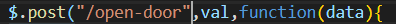
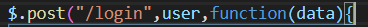
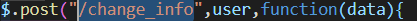
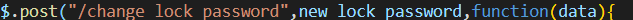
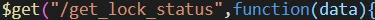
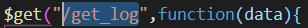

# api 设计文档
[TOC]

## 1.index.html 主页:

### 1. post ----- /open-door (约定初始为12345678)



提交:  输入的密码---`val` : 类型`string`

返回:  true 或者  false

### 2. post ---- /login  (约定初始用户名与密码都为123456)



提交:  登陆的用户名和密码  使用json格式

```javascript
var user = {
    name:"",
    password:""
};
```

返回:  0,1,2,3

0: 成功

1: 用户名错误

2: 密码错误

3: 用户名与密码都错误

## 2. Admin.html 管理员页面:

### 1. post ---- /change_info  (修改用户名和密码)



提交: 新的用户名和密码

```javascript
var user = {
    name:"",
    password:""
};
```

返回: true  或者 false

### 2. post ---- /change_lock_password  (修改门锁密码)



提交: 新的门锁密码   类型:`string`

返回: true 或者 false

### 3.  get ---- /get_lock_status



返回:  门的状态 类型:`string`

### 4. get ---- /get_log



返回:  日志内容  类型:`string`