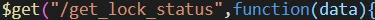
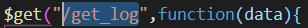

# 嵌入式系统设计期末项目

## 项目基本结构

进展：https://docs.qq.com/doc/DWWpPYVJZQWJOZkFi

## 单片机部分

### 51单片机状态抽象:

- 等待密码输入
    
    - 出现当前时间(hh-mm-ss)的时候为等待输入状态

- 密码输入正确

    - 7段管出现`tttttttt`代表输入正确

- 密码输入错误

    - 7段管出现`ffffffff`代表输入错误

- 开门: 

    - 出于开门状态的时候，`p47` LED 灯出于点亮状态
    
- 报警

    - 当门出于打开状态 `一定时间` 之后，会进入报警状态，此时 `P46` , `P47` LED灯都处于报警状态

### 按键说明:

- 数字键：输入密码

- A 键: 确认输入, 在输入密码之后，按下这个按键可以把当前输入的密码，传送到

- B 键：重新输入按键，在密码输入错误的时候，通过这个按键，重新进入密码输入状态。

- C 键：开门按键，模拟现实中的开门操作，当密码正确是时候，输入这个按键可以模拟把门打开。

- D 键：关门按键，模拟现实中的关门操作，在开门进入之后，按下此按键进入关门状态。

### 51 单片机连接 esp8266 模块

这两个模块之间需要通过 urat 来传输信息

- 开门的指令

- 当前门的状态

- 在门输入的密码

具体连线如下:

- esp8266 G(gound) <=> 51 GND 

- esp8266 Tx(transfer) <=> 51 P16(相当于 UART RX)
    
- esp8266 Rx(receive) <=> 51 P17(相当于 UART TX)

### 使用串口助手调试单片机

通过 两头USB 的线，连接电脑和单片机, 之后再把烧板的接口和UART接口连接起来，实现通过烧写接口向单片机UART串口发送/从单片机接收

具体连线如下:

- P30 <=> P17

- P31 <=> p16

## 信息传递约定

### 单片机 => wifi 模块

- `八位数字(0 - 9)`: 代表密码

- `cccccccc`：当前门的状态是关闭

- `oooooooo`：当前门的状态是开启

### wifi 模块 => 单片机

- `t`: 密码正确

- `f`: 密码错误

- `o`: 直接开门

### wifi 模块和后台服务器之间

### 数据库部分

处于轻量化考虑使用的是功能简单的数据库`Tinydb`，这是一个极为轻量化的 `nosql` 类型数据库 

使用数据库来存储被访问的密码输入的记录以及门锁报警记录

{
    事件:(1 -> 密码输入), (2 -> 报警)
    结果:(1 -> 密码输入结果)，(报警原因)
    时间:(事件发生时间)
}

### 前后端通信 api 文档

#### 1. post ----- /open-door (约定初始为12345678)


提交:  输入的密码---`val` : 类型`string`

返回:  true 或者  false

#### 2. post ---- /login  (约定初始用户名与密码都为123456)


提交:  登陆的用户名和密码  使用json格式

```javascript
var user = {
    name:"",
    password:""
};
```

返回:  0,1,2,3

0: 成功

1: 用户名错误

2: 密码错误

3: 用户名与密码都错误

## 2. Admin.html 管理员页面:

### 1. post ---- /change_info  (修改用户名和密码)


提交: 新的用户名和密码

```javascript
var user = {
    name:"",
    password:""
};
```

返回: true  或者 false

#### 2. post ---- /change_lock_password  (修改门锁密码)


提交: 新的门锁密码   类型:`string`

返回: true 或者 false

#### 3.  get ---- /get_lock_status



返回:  门的状态 类型:`string`

#### 4. get ---- /get_log



返回:  日志内容  类型:`string`


